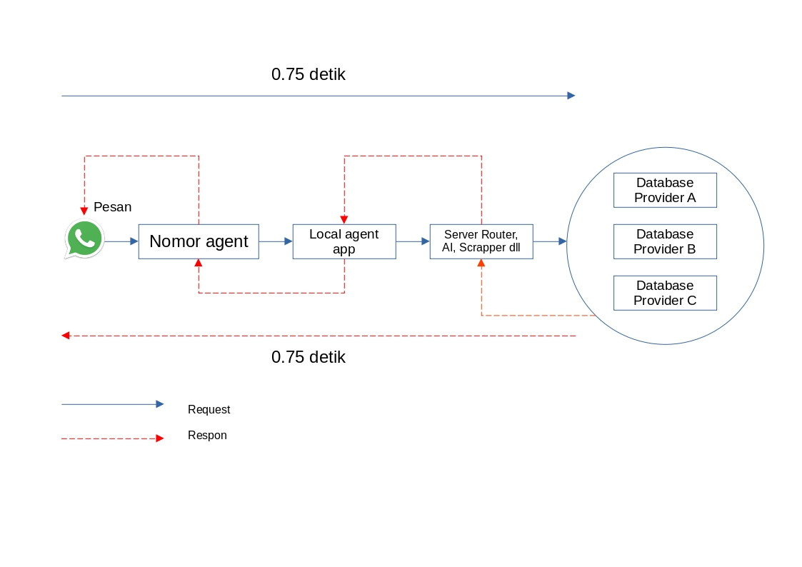

# Lentera

Lentera adalah bot kecerdasan buatan antar lintas pesan instan, saat ini lentera adalah :

1. Mesin pencari data yang hidup di WhatsApp dan Telegram

2. Mesin Translator yang hidup WhatsApp dan Telegram

Bot pesan instan saat ini banyak dipakai oleh layanan Pendukung perusahaan (support center) dengan menggunakan WhatsApp Bisnis, tetapi keperluan tersebut sifat nya lebih ke CRM. Lentera adalah universal tidak membutuhkan akun WhatsApp bisnis. 

# Motivasi

Bukankah perambah Google  sudah ada dan pengguna tinggal membuka perambah tersebut ? itu adalah pertanyaan yang paling sering dilemparkan, tetapi bayangkan jika kita dapat melakukan pencarian langsung di aplikasi WhatsApp/Telegram tanpa perlu pindah ke aplikasi lainnya seperti perambah, dan hasil pencarian sudah diformat sedemikian rupa sehingga mudah dalam menyalin dan menampal hasil tersebut untuk dikirim ke lawan bicara. Tentu saja ini hanya satu skenario, dengan kemampuan terhubung ke semua database yang ditengahi oleh rest API Json, Lentera dapat menjadi aplikasi apa saja  yang diinginkan.

# Teknologi Lentera

Lentera menggunakan beragam teknologi, seperti Dart untuk sisi pemrograman aplikasi mobile, Python dan Java di sisi server. Berikut arsitektur Lentera secara sederhana :

 

# Kebutuhan Hardware dan software

1. Akun WhatsApp/Telegram dan nomor yang aktif

2. Smartphone dengan kapabilitas untuk menerima pesan WhatsApp/Telegram, terkoneksi dengan internet kecepatan tinggi

3. Sebuah server dengan kelas kritikal min 8 CPU, 16GB Ram, koneksi inbound dan outbound yang sangat cepat (throughput tinggi dan latensi rendah)

4. Sistem operasi Linux server (Debian, Ubuntu atau Redhat)

5. Database Provider (exsisting aplikasi) yang dapat memberikan hubungan melalui Json Rest API
